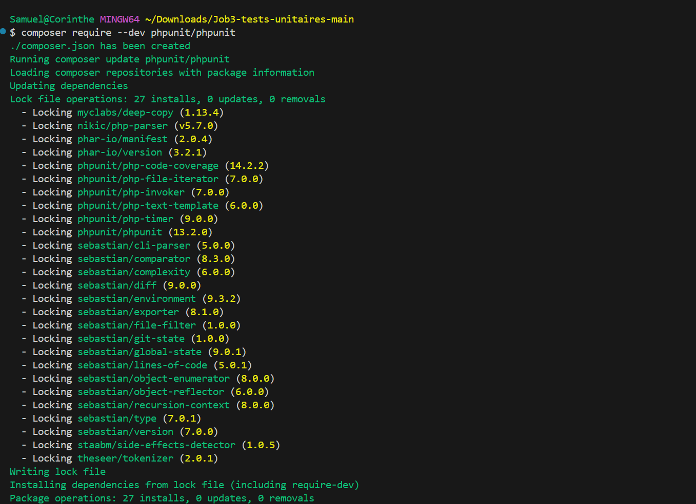
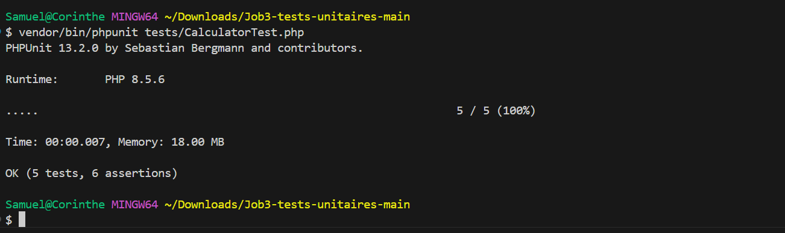
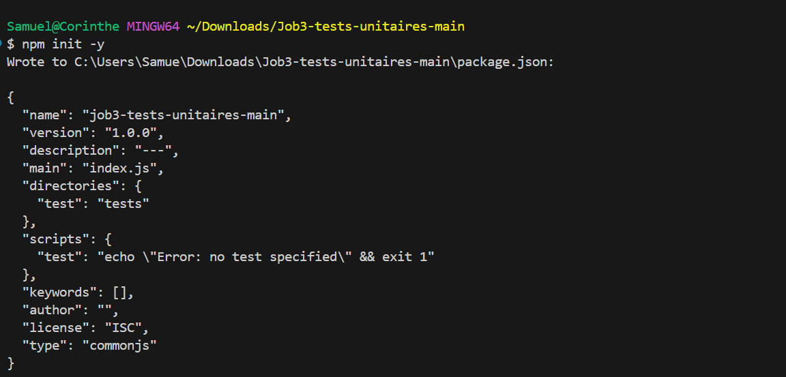
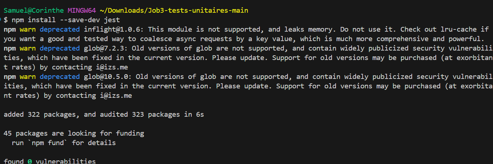
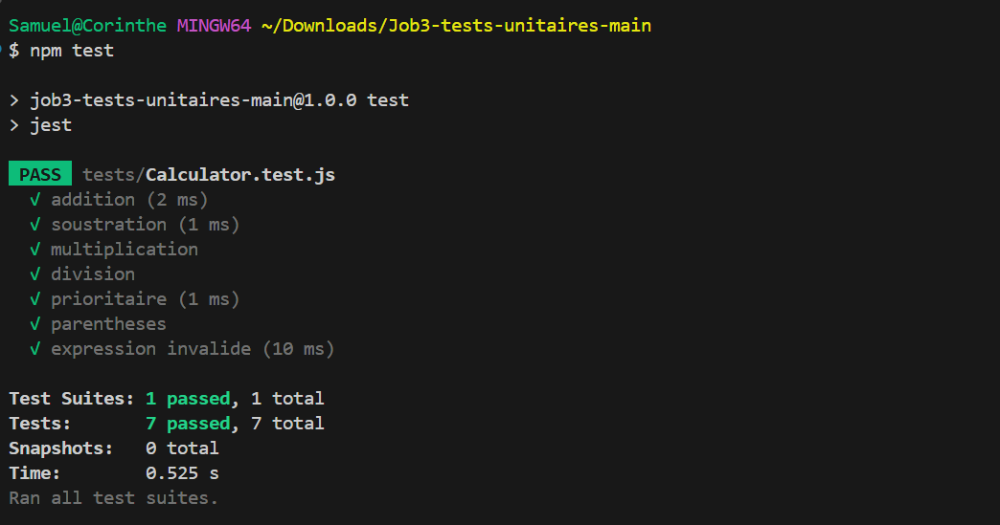

# Tests Unitaires  PHPUnit + Jest


## Tests PHP — PHPUnit


### Commande de lancement



---

```bash
vendor/bin/phpunit tests/CalculatorTest.php 
```


### Test



---

## Tests JavaScript — Jest


### Commande de lancement



---



---

```bash
npx jest tests/Calculator.test.js 
```


### Test



---

